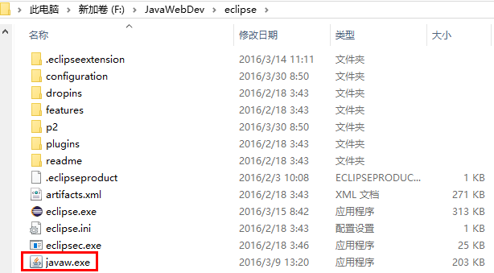
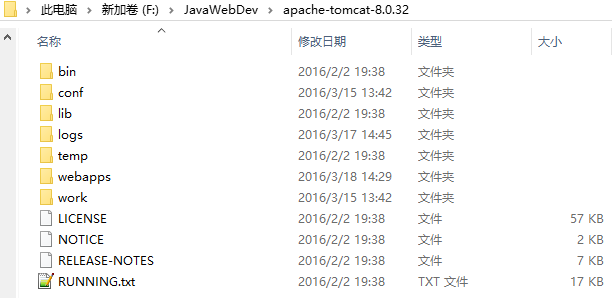
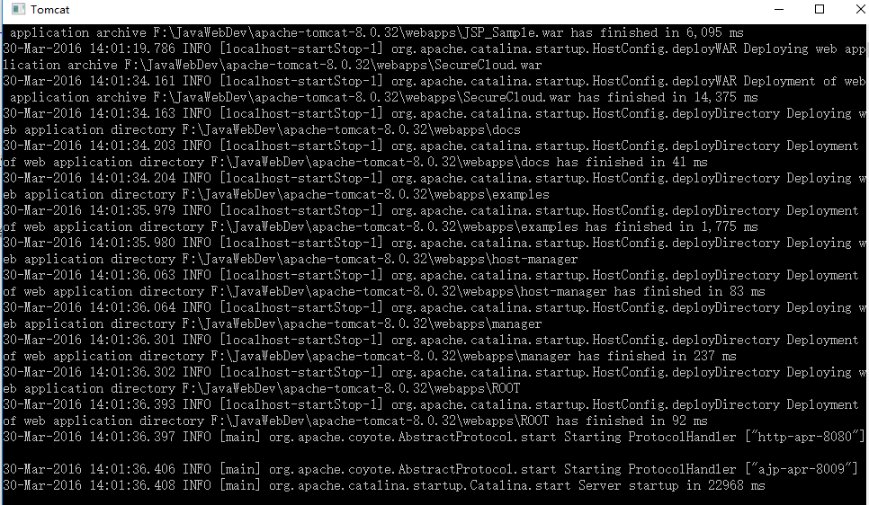
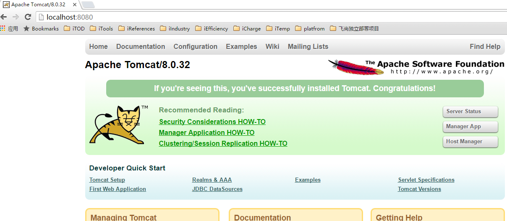
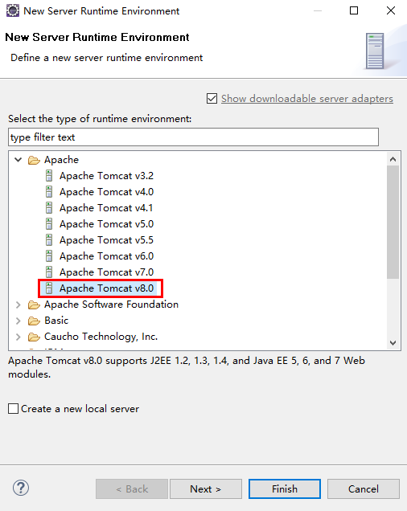
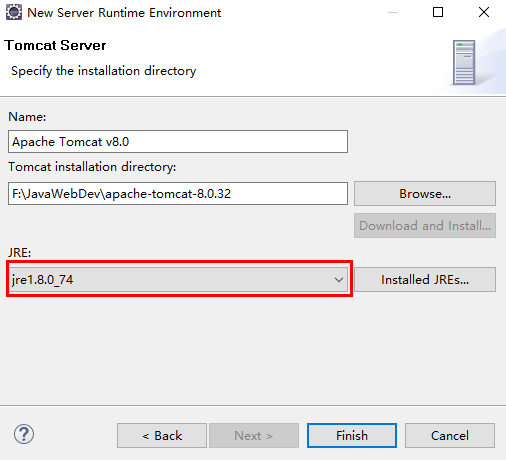

# JSP简介

## 什么是Java Server Pages?
JSP全称Java Server Pages，是一种动态网页开发技术。

它使用JSP标签在HTML网页中插入Java代码。标签通常以 `<%` 开头以 `%>` 结束。

JSP是一种Java servlet，主要用于实现Java web应用程序的用户界面部分。网页开发者们通过结合HTML代码、XHTML代码、XML元素以及嵌入JSP操作和命令来编写JSP。

JSP通过网页表单获取用户输入数据、访问数据库及其他数据源，然后动态地创建网页。

JSP标签有多种功能，比如访问数据库、记录用户选择信息、访问JavaBeans组件等，还可以在不同的网页中传递控制信息和共享信息。

## 为什么使用JSP？

-	JSP开发的WEB应用可以跨平台使用，既可以运行在Linux上也能运行在Windows上。

# JSP 开发环境搭建

## 配置Java开发工具（JDK）
java开发工具包JDK下载和PATH环境变量配置

### JDK下载安装
-	首先我们需要下载java开发工具包JDK，下载地址: [Java SE Downloads](http://www.oracle.com/technetwork/java/javase/downloads/index.html)
-	下载后JDK的安装根据提示进行，还有安装JDK的时候也会安装JRE，一并安装就可以了  
假定安装目录为 D:\Program Files\Java\jdk1.8.0_74

### 配置环境变量
-	安装完成后，右击"我的电脑"，点击"属性"
-	选择"高级"选项卡，点击"环境变量"
-	在"系统变量"中设置3项属性，JAVA_HOME,PATH,CLASSPATH(大小写无所谓)，若已存在则点击"编辑"，不存在则点击"新建"。变量设置： 
> 
>   - 变量名：JAVA_HOME  
	> 变量值：D:\Program Files\Java\jdk1.8.0_74
>	- 变量名：CLASSPATH
	> 变量值：.;%JAVA_HOME%\lib\dt.jar;%JAVA_HOME%\lib\tools.jar; // 记得前面有个"."
>	- 变量名：Path
	> 变量值：%JAVA_HOME%\bin;%JAVA_HOME%\jre\bin;

### 测试JDK是否安装成功
-	1 "开始"->;"运行"，键入"cmd"
-	2 键入命令"java -version"，出现画面，说明环境变量配置成功

		D:\Program Files\Java\jdk1.8.0_74\bin>java -version
		java version "1.8.0_74"
		Java(TM) SE Runtime Environment (build 1.8.0_74-b02)
		Java HotSpot(TM) 64-Bit Server VM (build 25.74-b02, mixed mode)

## 搭建Eclipse集成开发环境

Eclipse：一个免费开源的java IDE

### Eclipse下载安装

-	下载地址： [Eclipse J2EE](http://www.eclipse.org/) -> `Eclipse IDE for Java EE Developers`
-	Eclipse J2EE下载后，解压即可使用，将压缩文件解压到一个方便的地方，比如 F:\JavaWebDev\eclipse

> - 注意：  
> eclipse启动时需要 javaw.exe   
（可至 JDK 安装目录下： `D:\Program Files\Java\jdk1.8.0_74\jre\bin\javaw.exe` 拷贝）
> - 注释：  
	- javaw.exe是Sun Microsystems公司的相关网络协议软件，这个进程打开接口连到局域网或互联网，进程没有可视窗口 
	- javaw.exe是Sun公司的Java运行环境，它用来使Java程序可以运行在您的计算机上。这个特殊的进程和java.exe的不同之处在于，它运行的时候不显示窗口，其它的都一样。虽然它不是系统必须的，但是建议不要关闭它。因为很多程序和网页需要Java。

## 设置Web服务器：Tomcat
目前，市场上有很多支持JSP开发的Web服务器。他们中的一些可以免费下载和使用，Tomcat就是其中之一。

### Tomcat下载安装

-	Tomcat下载地址：[http://tomcat.apache.org/](http://tomcat.apache.org/) -> `Tomcat 8` -> `64-bit Windows zip (pgp, md5, sha1)`
> 说明: 目前较新版本的 Tomcat 推荐下载 `Tomcat 8` ，因为在后面的 `Tomcat和Eclipse相关联` 配置中，运行时环境配置可能不支持更新版本

-	下载完安装文件后，将压缩文件解压到一个方便的地方，比如 F:\JavaWebDev\apache-tomcat-8.0.32

目录介绍：

- bin：二进制执行文件，里面最常用的文件是startup.bat
- conf：配置目录，里面最核心的文件是server.xml，可以在里面改端口号等，默认端口号是8080
- lib：库文件，tomcat运行时需要的jar包所在的目录
- logs：日志
- temp：临时产生的文件，即缓存
- webapps：web的应用程序，web应用放置到此目录下浏览器可以直接访问
- work：编译以后的class文件。

### Tomcat启动
 
	F:\apache-tomcat-8.0.32\bin\startup.bat

可以双击 startup.bat 启动 Tomcat，界面如下：

至此，本地服务器搭建完成。

接着我们在浏览器中输入 `http://localhost:8080/`，如果显示如下界面，表示tomcat安装成功并且启动起来了：

### Tomcat停止
	F:\apache-tomcat-8.0.32\bin\shutdown.bat

- 可以双击 shutdown.bat 关闭服务器
- 或者直接关闭上面的启动窗口
- 或者在上面的启动窗口中进行一次 `Ctrl+C` 操作

## 将 Tomcat 和 Eclipse 相关联

> 1.我们打开Eclipse，选择菜单 `Window` -> `Preferences`， 弹出如下界面：

> 2.点击“Add”按钮，选择对应的 Tomcat 版本，这里选择 `v8.0`  
> **注意：**
> 如果下载 Tomcat 9.0 版本的话，下面的运行时环境列表中可能不支持，而导致配置失败！

> 3.点击“Next”，选择 Tomcat 的安装目录，并选择我们安装的 Java 环境

> 4.点击 "Finish"，完成配置

至此，完成了 JSP 开发环境的搭建