# 一个简单的 Hello World 示例，走进 JSP 世界

> 我们依然以 Hello World 认识下 JSP

## 创建 Web 工程

> 打开Eclipse，选择 `File-->New-->Dynamic Web Project` ，创建 `HelloWorld` 项目：

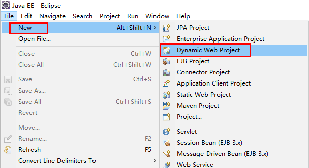

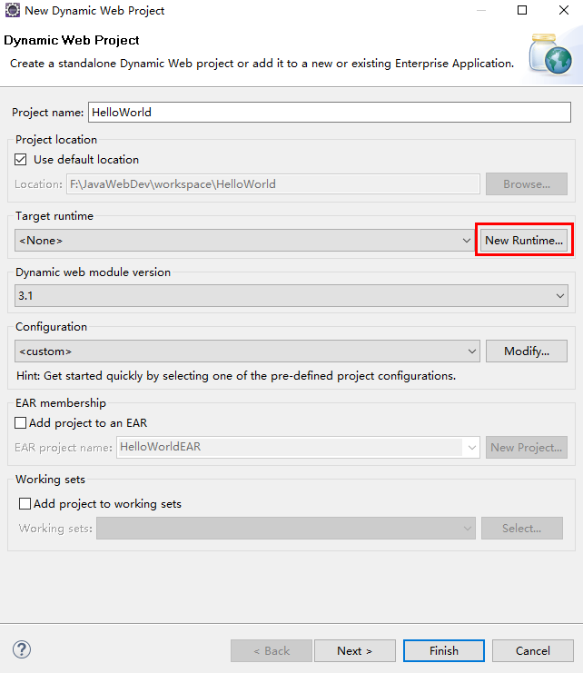

> 点击上图中 `New Runtime` 按钮，弹出如下界面：

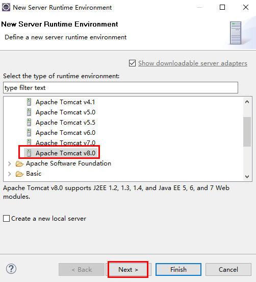

> 选择 `Apache Tomcat v8.0`，并 `Next`：

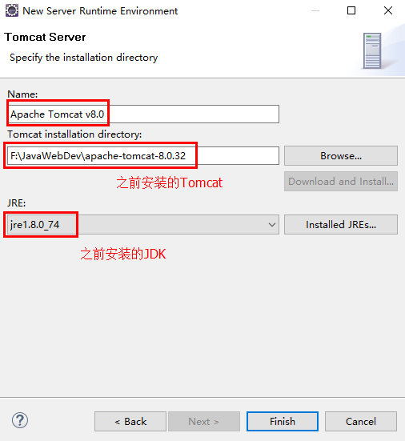

- 说明：如果已默认选择了我们之前安装的 Tomcat 和 JDK 则可跳过此步

> 点击 `Finish`

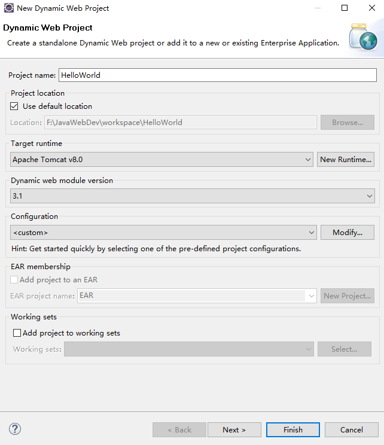

> 点击 `Next` -> `Next`, 至如下界面：

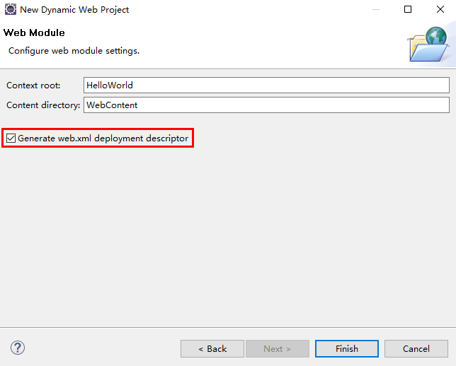

> 点击 `Finish` ，工程创建完成，工程文件结构如下：

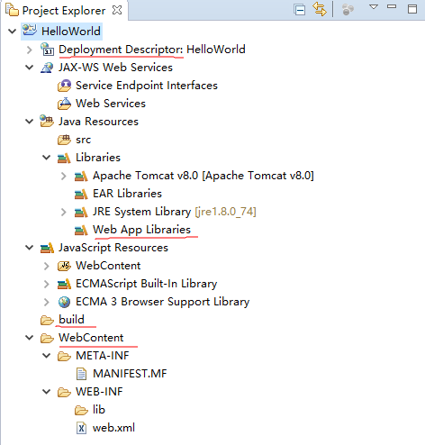

工程目录解析：

- `Deployment Descriptor` ：部署的描述
- `Web App Libraries` : 自己加的包可以放在里面
- `build` ： 放入编译之后的文件
- `WebContent` ： 放进写入的页面


## 新建 hello.jsp

在 `WebContent` 文件夹下新建一个 `hello.jsp` 文件:

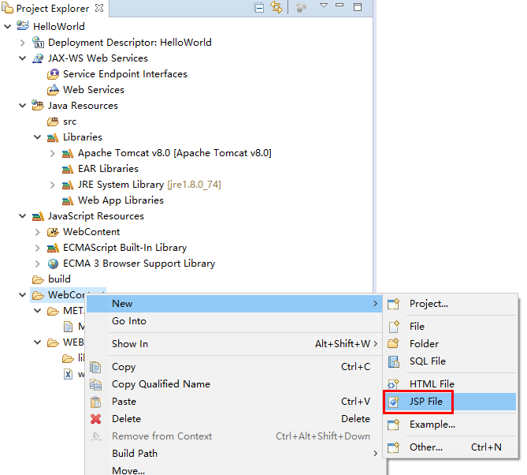

生成默认代码如下：

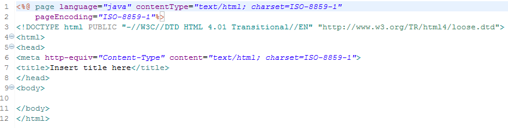

手动修改编码格式 `charset=UTF-8` 与 `pageEncoding="UTF-8"`

> 默认编码格式配置：选择 `Window` -> `Preferences` , 进行如下修改

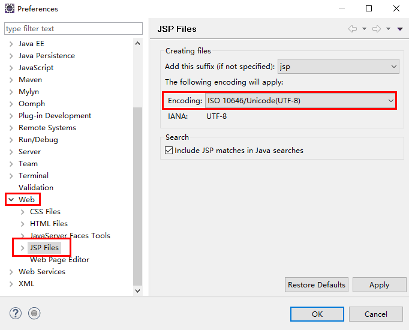


> 接着我们修改下hello.jsp文件代码：

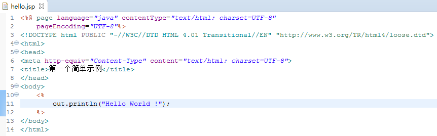

- 说明：   
脚本程序可以包含任意量的Java语句、变量、方法或表达式，只要它们在脚本语言中是有效的。  
脚本程序的语法格式：  
```<% 代码片段 %>```


## 运行 hello.jsp

> 运行 `hello.jsp` 之前，我们先修改下浏览器选项：

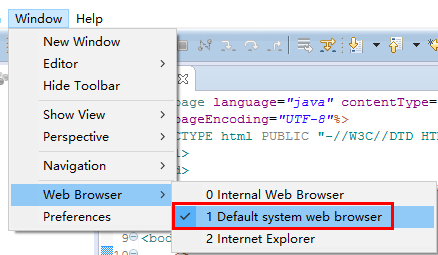

> 下面，我们右击 `hello.jsp` 运行该项目：

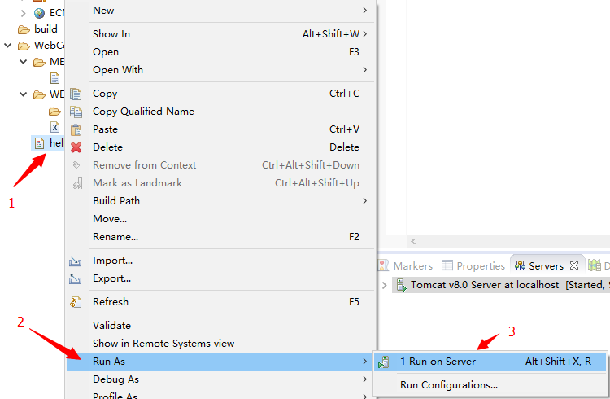

> 运行结果如下：

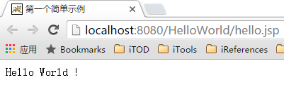

至此，一个简单的 `Hello World` 就完成了