# ASPX 转 JSP

**我们的目标：将 `.aspx` 转为 `.jsp`**

以安心云的 `index.aspx` 为例，说明如何转化为 `.jsp`  

## 新建 Web 工程

项目名称为 `SecureCloud` ，步骤详见 [2. jsp quick start with hello world](https://github.com/JulinPeng/iGit/blob/master/WorkSpace/jsp-step-by-step/2.%20jsp%20quick%20start%20with%20hello%20world.md) 

## web.xml 中添加配置项

由于 `index.aspx` 中用到了

	<add key="ApiURL" value="http://localhost:6002" />
	<add key="QingDaoR3UserId" value="106"/>
	<add key="scheme" value="anxinjoy"/>

等配置项，因此，在新建工程的 `web.xml` 中进行相应地配置：

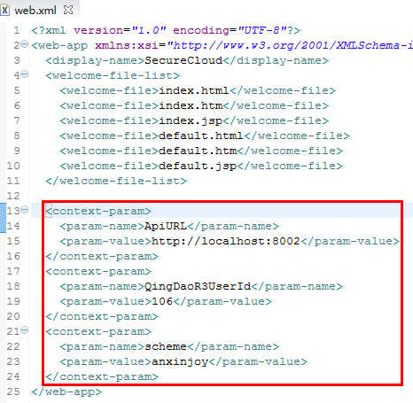

> PS：
> 在 `.jsp` 中通过以下方法获取 `param-name` 的值：

	application.getInitParameter()

## 新建 index.jsp

- 新建一个 `index.jsp` 文件，参见 [2. jsp quick start with hello world](https://github.com/JulinPeng/iGit/blob/master/WorkSpace/jsp-step-by-step/2.%20jsp%20quick%20start%20with%20hello%20world.md) 

- 拷贝安心云侧 `index.aspx` 代码，粘贴至 `index.jsp` （ -> 移除大量的功能注释），代码片段如下：


> 我们的目标：将 `.aspx` 转为 `.jsp` ，所以：  
1. 先把 `.aspx` 源代码拷贝至 `.jsp`   
2. 再解决编译错误，对不兼容的地方进行修改  
3. …… ，见招拆招

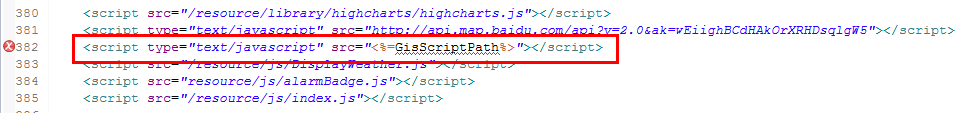

- 代码修改如下：

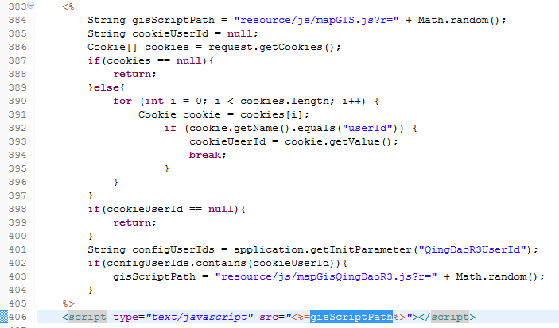

动态加载 `style_default.css` ：

	<%
    	String styleDefault = "resource/css/style_default.css";
		String scheme = application.getInitParameter("scheme");
     	if(scheme.equals("anxinjoy")){
     		styleDefault = "anxinzhuoyue/css/style_default.css";
     	}
    %>
    <link href="<%=styleDefault%>" rel="stylesheet" />

- 运行前，拷贝安心云 `WebClient\SecureCloud\resource` 和 `WebClient\SecureCloud\login.html` 至 工程的 `WebContent` 文件夹下，然后至 Eclipse 刷新(F5) 工程，工程目录结构如下：

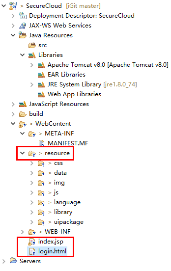

## 服务运行

### 访问登录页面

右键 `login.html` ，启动服务器运行服务

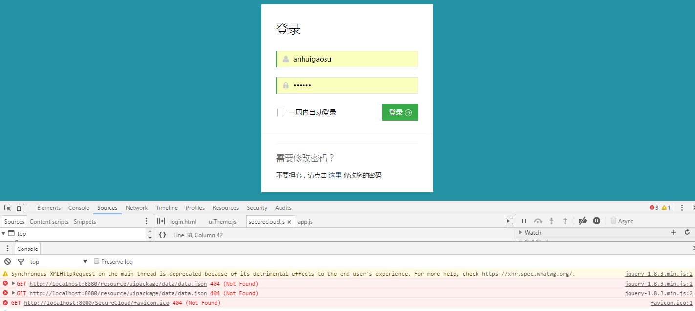

- `404 (Not Found)` ： 找不着 `resource/uipackage/data/data.json` 了，资源引用路径错误！

> 引用路径说明：
> 
- 在web应用中，以 “`/`” 开头的是绝对路径，不以 “`/`” 开头的是相对路径
- 客户端的绝对路径与服务器端的绝对路径中的 “`/`” 代表的意思是不同的  
	- 在服务器端，通常都使用绝对路径，服务器端的“/”等同于：`http://localhost:8080/SecureCloud/`（SecureCloud为工程名）
	- 在客户端，可使用绝对路径，也可使用相对路径，客户端的“/”等同于：`http://localhost:8080/`（它是不带工程名的）

在项目中 `Search` “data.json” 相关引用的地方：

	resource/uipackage/uiTheme.js
	resource/js/securecloud.js

在 `uiTheme.js` 中有如下代码片段：

	var dataroot = "/resource/uipackage/data/data.json";
    $.ajaxSettings.async = false;
    $.getJSON(dataroot, function (data) {
        //console.debug(data.title);
        //console.debug(data.copyright);
        themetext.title = data.title;
        themetext.copyright = data.copyright;
        themetext.project = data.project;
        themetext.loginBg = data.loginBg ? data.loginBg : false;
        themetext.loginBgY = data.loginBgY ? data.loginBgY : 120;
        themetext.loginBgX = data.loginBgX ? data.loginBgX : "auto";
        themetext.loginBgColor = data.loginBgColor ? data.loginBgColor : '#fff';
    });

使用了绝对路径，即 `http://localhost:8080/resource/...` ，路径中缺少了工程名，因此，not found ！

- 解决方案 
 
获取正确的绝对路径： 

	var projectName = window.location.pathname.split('/')[1];
    var dataroot = "/" + projectName +  "/resource/uipackage/data/data.json";

同样地，`securecloud.js` 也做相应修改，修改后刷新页面：

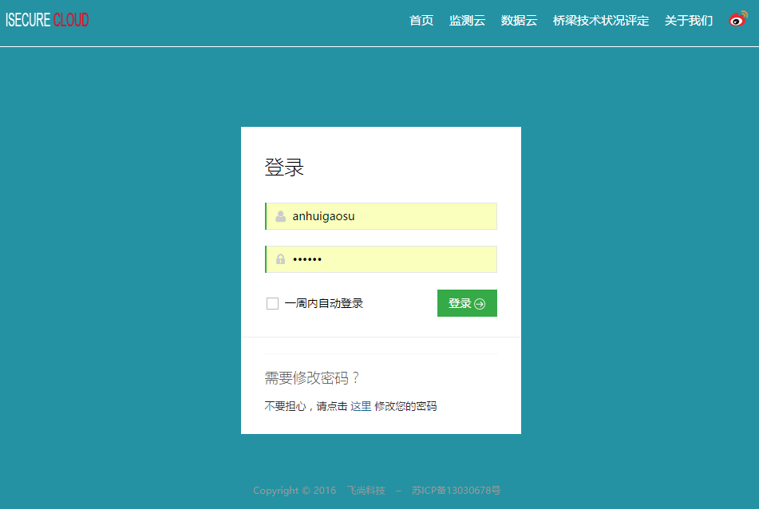

- 还少一个 `favicon`

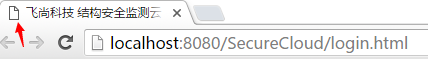

拷贝安心云 `WebClient\SecureCloud\favicon.ico` 至 工程的 `WebContent` 文件夹下，然后至 Eclipse 刷新(F5) 工程，刷新网页

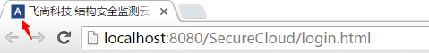


### 登录系统

- 点击 `登录` 按钮

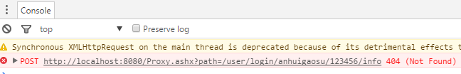

- 修改接口请求 `url`

新建 `common.jsp` 并在其中定义 `apiurl` ，如下：

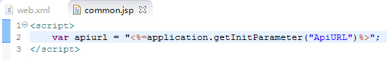

为了使用 `common.jsp` 中定义的 `apiurl` ，需要将 `login.html` 转换为 `login.jsp` ：

> 1.将 `login.html` 重命名为 `login.jsp`  
> 2.修改 `login.jsp`  
> (1) 在 `login.jsp` 开头添加
> 
	<%@ page language="java" contentType="text/html; charset=UTF-8"
    pageEncoding="UTF-8"%>
> (2) 分别在 `login.jsp` 和 `index.jsp` 脚本引用前添加
> 
	<%@ include file="common.jsp" %>
> 3.为了正常加载主题，修改 `uiTheme.js`
>
	if (/login.html$/g.test(document.location.pathname) || ...)
	改为：
	if (/login.(jsp)|(html)$/g.test(document.location.pathname) || ...)

> 4.注释原 `apiurl` 的定义  
> 在 `securecloud.js` 中对 `apiurl` 有如下定义：
>
	var apiurl = getRootPath() + "/Proxy.ashx?path=";
注释掉！

> 5.修改用户侧登录成功后的页面跳转  
> `securecloud.js` 相关代码如下：
> 
	function userInitHerf(orgId) {
		...
		// window.location.href = "/index.aspx";
		// 改为
		var projectName = window.location.pathname.split('/')[1];
        window.location.href = "/" + projectName + "/index.jsp";
		...
	}

- 刷新登录页面，点击 `登录` 按钮，进入项目主页

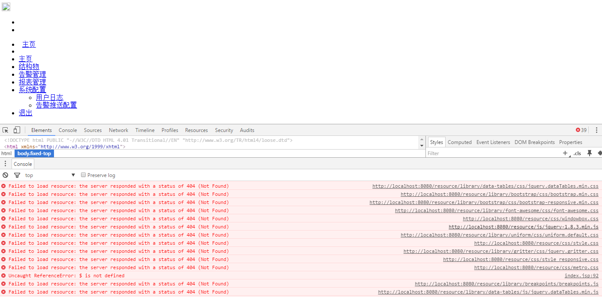

同样地，代码中多处 

	<script src="/resource/..."></script>

使用了绝对路径，这里的绝对路径指的是 `http://localhost:8080/resource/...` ，因此，not found ！

- 解决方案 
	- 方案1：使用相对路径，凡资源引用路径为 `/resource/...` 均改为 `resource/...`
	- 方案2：使用绝对路径  
客户端的绝对路径中都要带着工程名，是写死的，假如有一天工程名修改了，所有页面中的路径引用都要改，工作量太大。  
所以工程名不能写死，要动态获取，改成这样就可以了：

``` 
    <script src="<%=request.getContextPath()%>/resource/...">
```

`request.getContextPath()` 就是获取工程名： `/SecureCloud` （注意：这种方式只适用于JSP，html因为是静态页面不能写java代码，所以只能将工程名写死！）

为了保持引用方式的习惯性及一致性，我们尽量采用相对路径的方式，将 `index.jsp` 中所有绝对路径的引用改为相对路径，再运行...

如果有 `404 (Not Found)` 错误的话，大多是资源的引用路径有错，参照前面的方案解决就好，直至没有任何错误：

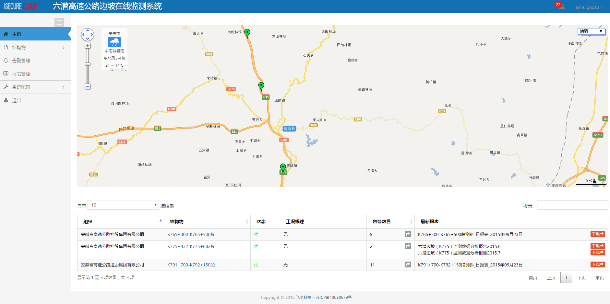

## 小结

以上，我们详细地说明了如何将 `.aspx` 转为 `.jsp` ，希望通过本节使你能够完成基本的 `jsp` 转换工作。

转换过程中的注意点：

- 资源引用路径问题，目前安心云代码中大量的 `/resource/...`

- 配置属性